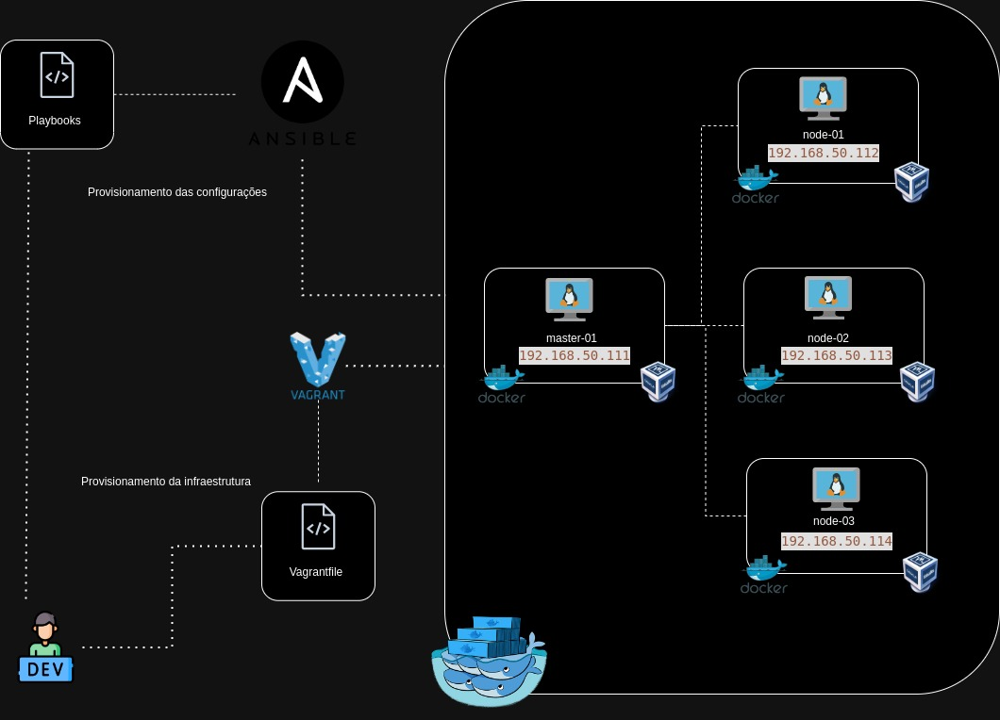
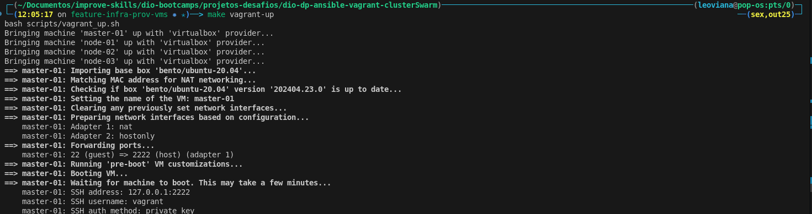
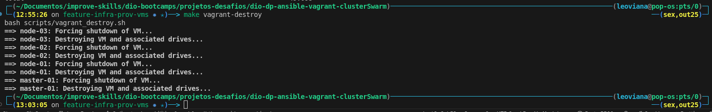
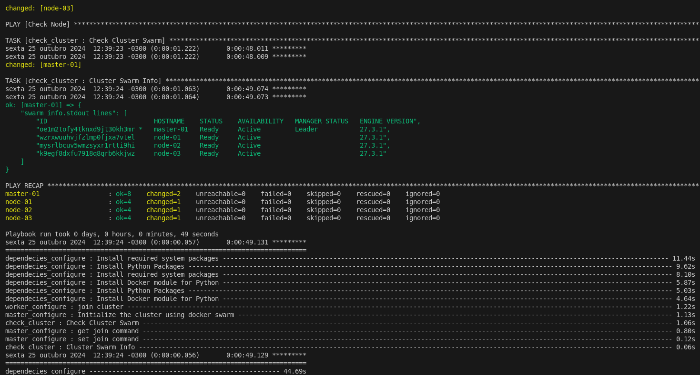

<h1 align="center">Desafio Docker - DIO</h1>

<p align="center">
  
  
  
</p>


<p align="center">
  
</p>


## ✨ Tecnologias

- Virtualbox
- Vagrant
- Docker
- Ansible
- Docker Swarm

## 🚀 Provisionamento da infraestrutura

- Criando as VMs

```bash
make vagrant-up
```

<p align="center">
  
</p>

>[!NOTE]
> Estou utilizado 4 vms, caso queira reduzir a quantidade de vms, basta remover algumas no arquivo [vagrantfile](./Vagrantfile)
>Abaixo tem um `vagrantfile` com apenas 1 mastr e 1 node.

```vagrantfile
machines = {
  "master-01" => {"memory" => "2048", "cpu" => "2", "ip" => "111", "image" => "bento/ubuntu-20.04"},
  "node-01"   => {"memory" => "2048", "cpu" => "2", "ip" => "112", "image" => "bento/ubuntu-20.04"}
}

Vagrant.configure("2") do |config|

    machines.each do |name, conf|
        config.vm.define "#{name}" do |machine|

            # Configurações iniciais das vms
            machine.vm.box = "#{conf["image"]}"
            machine.vm.hostname = "#{name}.lab.docker.io"
            machine.vm.network "private_network", ip: "192.168.50.#{conf["ip"]}"

            # Provisionamento do Docker
            machine.vm.provision :docker

            # Adicionando ssh keys
            machine.vm.provision "shell" do |s|
                ssh_pub_key = File.readlines("./keys/docker.pub").first.strip
                s.inline = <<-SHELL
                echo #{ssh_pub_key} >> /home/vagrant/.ssh/authorized_keys
                echo #{ssh_pub_key} >> /root/.ssh/authorized_keys
                echo "Ambiente para laboratório: Desafio Docker Swarm - DIO" > /tmp/vagrant.txt
            SHELL
            end

            # Recursos
            machine.vm.provider "virtualbox" do |vb|
                vb.name = "#{name}"
                vb.memory = conf["memory"]
                vb.cpus = conf["cpu"]
            end
        end
    end
end
```


- Destrir as VMs

```bash
make vagrant-destroy
```

<p align="center">
  
</p>

## 🚀 Provisionamento das configurações

- Configuração do `Docker Swarm`

```bash
make swarm-cluster
```

<p align="center">
  
</p>


## 📃 Refeências

- [ Ínstalação do Vagrant no Linux ](https://developer.hashicorp.com/vagrant/install)
- [ Instalação do Ansible no Linux ](https://docs.ansible.com/ansible/latest/installation_guide/installation_distros.html) 
- [ Instalação do Virtualbox ](https://www.virtualbox.org/wiki/Linux_Downloads)
- [ Instalação do Docker ](https://docs.docker.com/engine/install/ubuntu/)
- [ Inicializar um Cluster Docker Swarm](https://docs.docker.com/engine/swarm/swarm-tutorial/create-swarm/)
- [ Criar SSH Keys ](https://docs.oracle.com/en/cloud/cloud-at-customer/occ-get-started/generate-ssh-key-pair.html)

